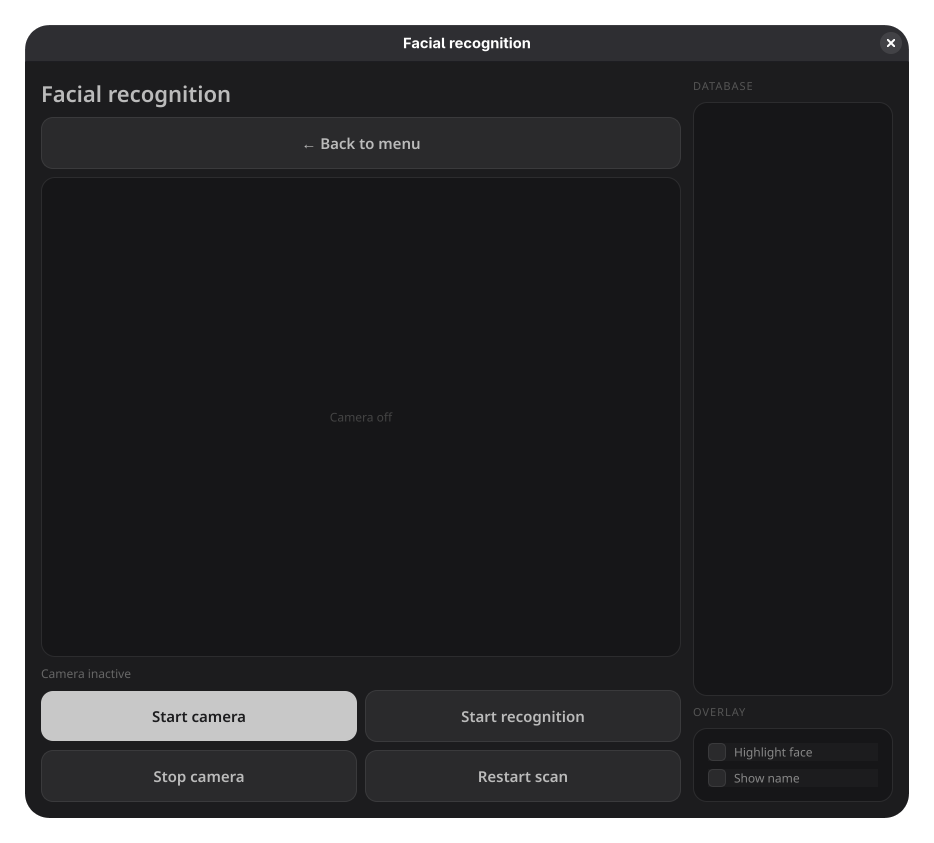
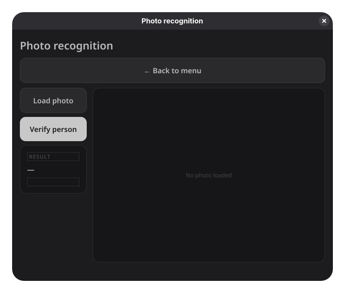
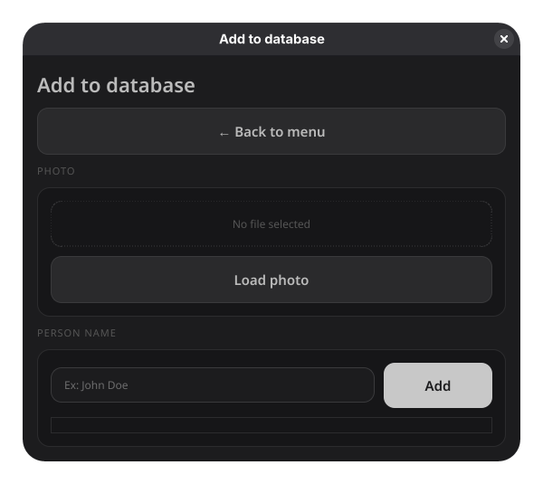

# Facial Recognition App

A desktop facial recognition application built with PyQt5 and DeepFace, capable of identifying people in real time via webcam or from photos.

---

## Screenshots

> Main menu


> Video recognition



> Photo recognition



> Add to database



---

## System requirements

- Linux (tested on Fedora)
- Python 3.10
- Webcam (for video recognition)

---

## Installation

### 1. Clone the repository

```bash
git clone https://github.com/username/facial-recognition-app.git
cd facial-recognition-app
```

### 2. Create a Python 3.10 virtual environment

```bash
python3.10 -m venv venv
source venv/bin/activate
```

### 3. Install dependencies

```bash
pip install PyQt5 deepface numpy openpyxl tf-keras
```

> **Note:** DeepFace automatically installs `opencv-python`, which conflicts with PyQt5. Run the commands below to fix the conflict:

```bash
pip uninstall opencv-python
pip install opencv-python-headless
```

### 4. Run the application

```bash
python3.10 menu.py
```

---

## Project structure

```
.
├── menu.py                  # Main menu
├── recognition.py           # Video recognition (webcam)
├── photo_recognition.py     # Photo recognition
├── add_to_database.py       # Add people to the database
├── dialog.py                # Detection dialog
├── style.qss                # UI styles
├── face-scan.png            # App icon
├── faces/                   # Photo database
│   ├── Ion_Popescu.jpg
│   └── ...
├── logs.xlsx                # Identification history
└── screenshots/             # README screenshots
```

---

## Usage

### Video recognition

1. From the main menu, click **Video recognition**
2. Click **Start camera** to activate the webcam
3. Click **Start recognition** to begin scanning
4. If a person from the database is detected, a dialog appears with their name and confidence score
5. Click **Restart scan** to scan again
6. Check **Highlight face** and **Show name** for overlay on the video feed

### Photo recognition

1. From the main menu, click **Photo recognition**
2. Click **Load photo** and select a `.jpg` or `.png` image
3. Click **Verify person** to identify the person in the photo
4. The result appears in the left panel with the name and confidence score

### Add to database

1. From the main menu, click **Add person to database**
2. Click **Load photo** and select a photo with the person's face
3. Enter the person's name in the text field
4. Click **Add** — the photo will be saved in the `faces/` folder

---

## Technologies used

| Technology | Role |
|---|---|
| Python 3.10 | Programming language |
| PyQt5 | Graphical user interface |
| DeepFace | Facial recognition (VGG-Face model) |
| OpenCV | Webcam video capture |
| TensorFlow | DeepFace backend |
| openpyxl | Save identification history to Excel |

---

## Note

On the first run of the recognition, DeepFace automatically downloads the VGG-Face model (~580MB). This happens only once.